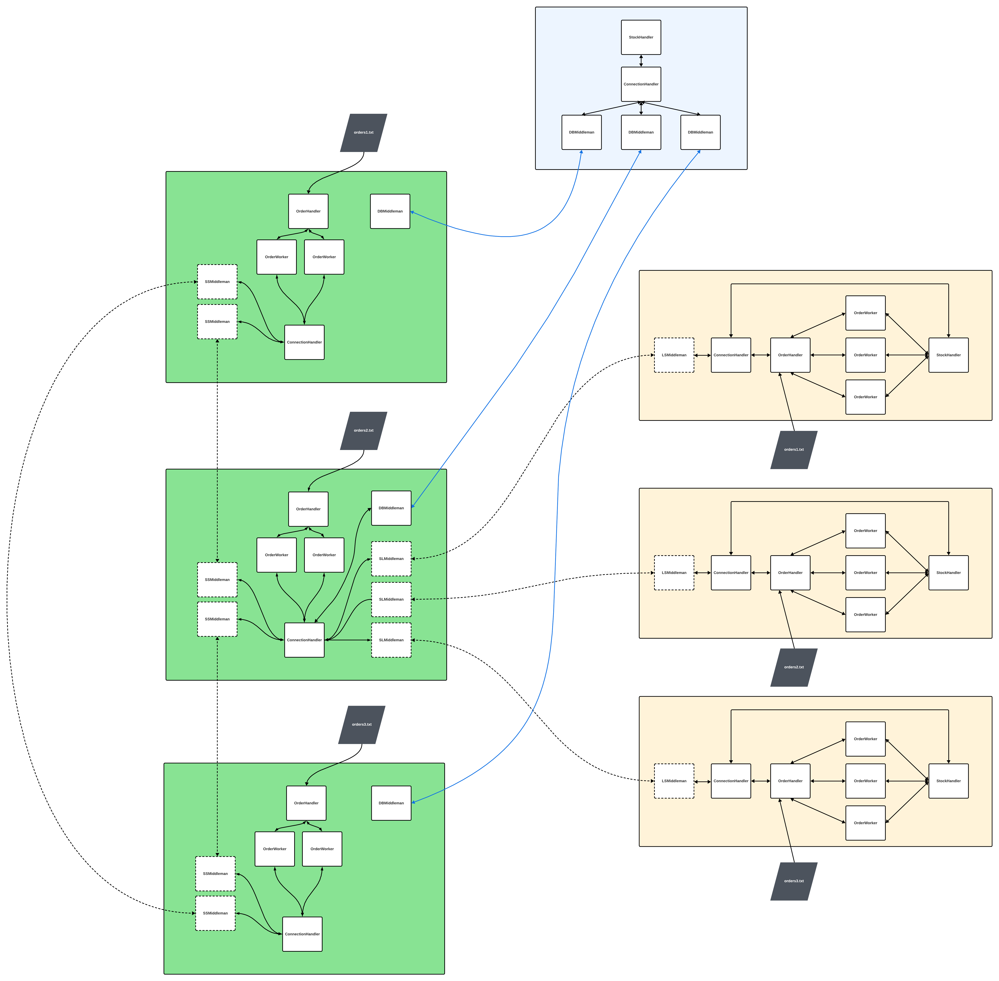
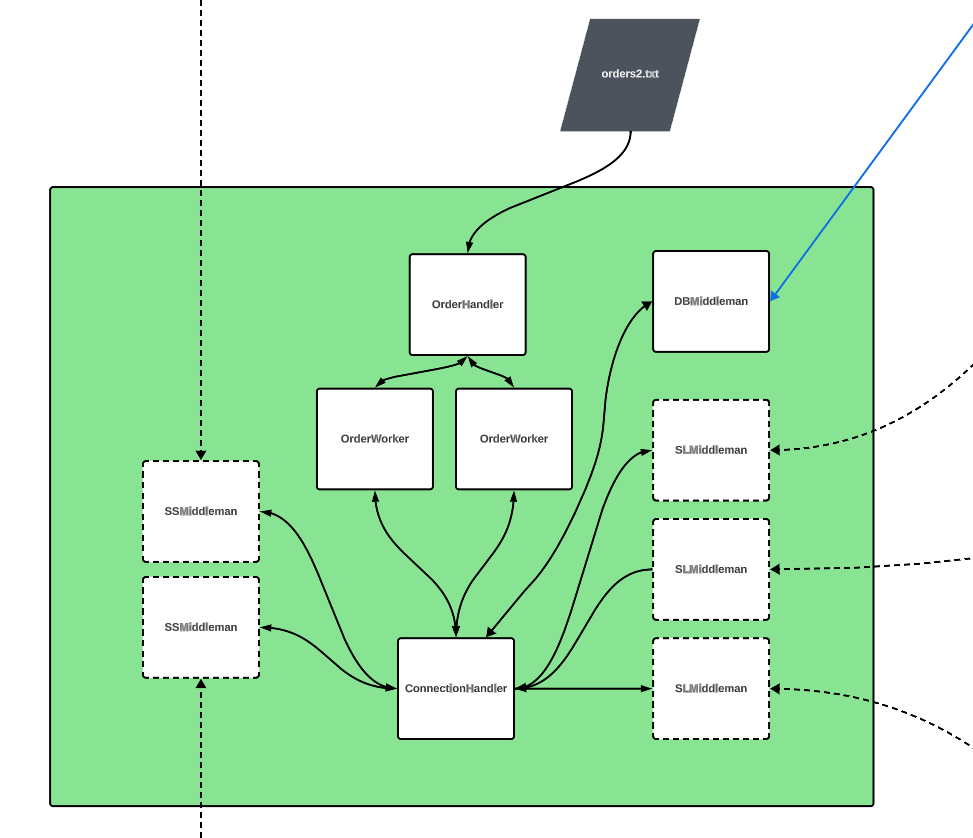

[](https://classroom.github.com/a/AdDZ0HGe)

---

# [75.59] TP Ferris-Commerce - Tecnicas de Programacion Concurrente I - 1c2023

---

<br>
<p align="center">
  
</p>
<br>

---

## Grupo Ferris-Appreciators-2

### Integrantes

| Nombre                                                              | Padrón |
| ------------------------------------------------------------------- | ------ |
| [Luciano Gamberale](https://github.com/lucianogamberale)            | 105892 |
| [Erick Martinez](https://github.com/erick12m)                       | 103745 |
| [Miguel Vasquez](https://github.com/MiguelV5)                       | 107378 |

---

## Introducción

El presente trabajo práctico tiene como objetivo la creación de software para el manejo de stocks de una cadena de tiendas distribuida por todo el país.

Las aplicaciones simulan el manejo desde el sitio de e-commerce, además de locales físicos que pueden operar independientemende del estado de conexión actual del local. 

Puede encontrar el enunciado [aquí](https://concurrentes-fiuba.github.io/2C2023_tp.html). 

## Ejecución:

### E-commerce

```bash
cargo run -p ferris_e_commerce -- -ss <servers_listening_port> -sl <locals_listening_port>  [-o <orders_file_path>]
```

### Local shop

```bash
cargo run -p ferris_local_shop -- -o <orders_file_path> -s <stock_file_path> -w <num_workers>
```

### Database

```bash
cargo run -p ferris_db
```

### Comandos

Ambos a su vez proveen comandos para interactuar con el sistema durante la ejecución:
- e_commerce:
    - `q`: cierra el e-commerce de forma segura.
    - `s`: comienza el procesado de las ordenes recibidas.
	- `cc`: cierra todas las conexiones con los locales y con los demás servidores de e-commerce. El proceso sigue activo.
	- `rc`: restaura todas las conexiones con los demás servidores de e-commerce y reanuda la escucha a conexiones de locales.
- local_shop:
    - `q`: cierra el local de forma segura.
    - `s`: comienza el procesado de las ordenes recibidas.
    - `cc`: cierra la conexión con el e-commerce. El proceso sigue activo.
	- `rc`: restaura la conexión con el e-commerce.

### Tests

```bash
cargo test
```
---

## Informe

### Arquitectura

#### General

<p align="center">
    
</p>
<br>
<p align="center">
    
</p>

#### E-commerce

Los nodos de e-commerce se encargan de recibir ordenes de compra y distribuirlas a los locales físicos. Para esto, se utiliza un sistema de colas de mensajes, donde cada local tiene su propia cola. Este sistema es manejado por medio de la abstracción de Actores que provee la librería [Actix](https://actix.rs/). 

En particular se implementan los siguientes actores:
- `SLMiddleman`: se encarga de recibir las ordenes de compra y distribuirlas a los locales físicos, manejar el estado de conexión con los mismos, y reenviar resultados recibidos desde los locales al actor `OrderHandler`.
- `SSMiddleman`: se encarga de manejar las comunicaciones directas por sockets con los demas nodos de e-commerce.
- `ConnectionHandler`: se encarga del manejo general del estado de conexion y todas las posibles redirecciones de acciones que se requieran realizar en los distintos actores del e-commerce. Esto incluye, por ejemplo, manejo del algoritmo de eleccion de lider y reenvio de resultados y delegación de procesamiento de ordenes al nodo correspondiente. Es la entidad principal del e-commerce y se mantiene activo aun cuando se cierran las conexiones.
- `OrderHandler`: se encarga de distribuir mensajes relacionados a las ordenes solicitadas y a recibir el resultado final de las mismas. Para esto se comunica con `OrderWorkers`.
- `OrderWorker`: se encarga de procesar ordenes recibidas desde el `OrderHandler` e interactuar con el `ConnectionHandler` para conocer el stock de la base de datos y elegir la solicitud correspondiente a los locales segun disponibilidad y cercanía.


<p align="center">
    
</p>

#### Local shop

Los nodos de local shop se encargan de recibir ordenes de compra y procesarlas, de dos fuentes distintas: peticiones de e-commerce y ordenes locales. 

Se implementan los siguientes actores:
- `StockHandler`: se encarga de manejar el stock de productos del local, y de responder a consultas de disponibilidad de stock, asi como peticiones de reserva.
- `OrderWorker`: se encarga de procesar una orden de compra, ya sea local o de e-commerce. Para esto, se comunica con el actor `StockHandler` para verificar disponibilidad de stock, y con el actor `OrderHandler` para notificar resultados.` 
- `OrderHandler`: se encarga de reenviar mensajes relacionados a todas las ordenes solicitadas al actor correspondiente, segun sea para delegar el procesamiento de una orden o para reenviar un resultado de procesamiento hacia el `ConnectionHandler`.
- `ConnectionHandler`: se encarga del manejo general del estado de conexion con los e-commerce, incluyendo registro y login del local, y todas las posibles redirecciones de mensajes que se requieran realizar entre los dos.
- `LSMiddleman`: se encarga de recibir las ordenes de compra de los e-commerces, y de informar acerca de las continuas finalizaciones de ordenes ocurridas en el local. Es el actor que se comunica directamente por sockets con los `SLMiddleman` del e-commerce.


<p align="center">
    
</p>

### Diagramas de threads y comunicaciones

#### E-commerce


#### Local shop


### Decisiones de diseño


