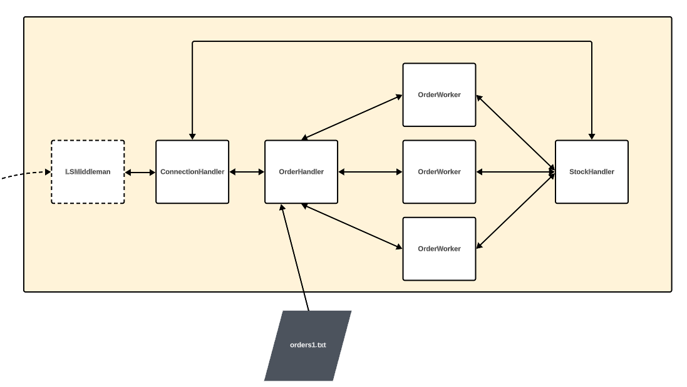

---

# [75.59] TP Ferris-Commerce - Tecnicas de Programacion Concurrente I - 1c2023

---

<br>
<p align="center">
  
</p>
<br>

---

## Grupo Ferris-Appreciators-2

### Integrantes

| Nombre                                                              | Padrón |
| ------------------------------------------------------------------- | ------ |
| [Luciano Gamberale](https://github.com/lucianogamberale)            | 105892 |
| [Erick Martinez](https://github.com/erick12m)                       | 103745 |
| [Miguel Vasquez](https://github.com/MiguelV5)                       | 107378 |

---

<p align="center">
    
</p>

---

## Introducción

El presente trabajo práctico tiene como objetivo la creación de software para el manejo de stocks de una cadena de tiendas distribuida por todo el país.

Las aplicaciones simulan el manejo desde el sitio de e-commerce, además de locales físicos que pueden operar independientemende del estado de conexión actual del local. 

Puede encontrar el enunciado [aquí](https://concurrentes-fiuba.github.io/2C2023_tp.html). 

## Ejecución:

### E-commerce

```bash
cargo run -p ferris_e_commerce -- -ss <servers_listening_port> -sl <locals_listening_port>  [-o <orders_file_name>] [-l <log_level>]
```
***Notas:*** 
- *Valores posibles para `log_level`: `debug`, `info`.  Por defecto es `info`.*
- *Valores posibles para `locals_listening_port`: 11000 al 11009.*
- *Valores posibles para `servers_listening_port`: 15000 al 15009.*
- *Los archivos de ordenes se encuentran en el directorio `ferris_e_commerce/data/orders/`.*
- *Si no se especifica `orders_file_name`, se utilizará el archivo `orders1.txt` por defecto*

### Local shop

```bash
cargo run -p ferris_local_shop -- [-o <orders_file_name>] [-s <stock_file_name>] [-w <num_workers>] [-l <log_level>]
```
***Notas:*** 
- *Valores posibles para `log_level`: `debug`, `info`.  Por defecto es `info`.*
- *Los archivos de ordenes se encuentran en el directorio `ferris_local_shop/data/orders/`.*
- *Los archivos de ordenes se encuentran en el directorio `ferris_local_shop/data/stock/`.*
- *Si no se especifica `orders_file_name`, se utilizará el archivo `orders1.txt` por defecto*
- *Si no se especifica `stock_file_name`, se utilizará el archivo `stock1.txt` por defecto*

### Database

```bash
cargo run -p ferris_db
```

### Comandos

Los procesos proveen comandos para interactuar con el sistema durante la ejecución:
- e_commerce:
    - `q`: cierra el e-commerce de forma segura.
    - `s`: comienza el procesado de las ordenes recibidas.
	- `cc`: cierra todas las conexiones con los locales y con los demás servidores de e-commerce. El proceso sigue activo.
	- `rc`: restaura todas las conexiones con los demás servidores de e-commerce y reanuda la escucha a conexiones de locales.
- local_shop:
    - `q`: cierra el local de forma segura.
    - `s`: comienza el procesado de las ordenes recibidas.
    - `cc`: cierra la conexión con el e-commerce. El proceso sigue activo.
	- `rc`: restaura la conexión con el e-commerce.
- database:
    - `q`: cierra la base de datos de forma segura.

---

## Informe

### Arquitectura

#### General

El sistema se compone de tres tipos de nodos/procesos: e-commerce, local shop y database. 

<p align="center">
    
</p>

Los nodos de e-commerce se encargan de recibir ordenes de compra y distribuirlas a los locales físicos. También se encargan de manejar el estado de conexión con los mismos, y manejar la comunicación con otros nodos de e-commerce para reenviar resultados de ordenes de compra, delegar ordenes al nodo lider actual, mantener actualizado el stock de productos de la base de datos, y manejar el algoritmo de elección de lider.

Los nodos de local shop se encargan de recibir ordenes de compra y procesarlas, de dos fuentes distintas: peticiones de e-commerce y ordenes locales. Tambien, cuando estan conectados a un e-commerce, se encargan de notificar los resultados de las ordenes de compra al mismo. Los mismos pueden operar independientemente del estado de conexión, y se encargan de mantener actualizado su estado local de stock y de resultados de ordenes de compra para poder reportarlos al e-commerce cuando se restablece la conexión.

La base de datos se encarga de mantener una copia en memoria del stock de productos de todos los locales físicos (para uso de los nodos e-commerce), y de responder a consultas de disponibilidad de stock. Este stock solo se actualiza cuando se recibe una orden de compra exitosa desde un local físico, el stock real de los locales es manejado por ellos mismos cuando se procesan ordenes de compra. Su unico uso es mantener un backup de la informacion de stock de los locales, independientemente de su estado de conexion y del estado de conexion de los e-commerce. 

Especificamente, cada proceso se compone de distintos actores que llevan a cabo las distintas responsabilidades del mismo y se comunican entre si mediante colas de mensajes que operan concurrentemente sobre el runtime que provee el framework actix.

A continuación se detallan los actores implementados para cada nodo, y su interacción con otros actores y nodos:

<br>
<p align="center">
    
</p>

#### E-commerce

En particular se implementan los siguientes actores:
- `SLMiddleman`: se encarga de recibir las ordenes de compra y distribuirlas a los locales físicos, manejar el estado de conexión con los mismos, y reenviar resultados recibidos desde los locales al actor `OrderHandler`.
- `SSMiddleman`: se encarga de manejar las comunicaciones directas por sockets con los demas nodos de e-commerce.
- `ConnectionHandler`: se encarga del manejo general del estado de conexion y todas las posibles redirecciones de acciones que se requieran realizar en los distintos actores del e-commerce. Esto incluye, por ejemplo, manejo del algoritmo de eleccion de lider y reenvio de resultados y delegación de procesamiento de ordenes al nodo correspondiente. Es la entidad principal del e-commerce y se mantiene activo aun cuando se cierran las conexiones.
- `OrderHandler`: se encarga de distribuir mensajes relacionados a las ordenes solicitadas y a recibir el resultado final de las mismas. Para esto se comunica con `OrderWorkers`.
- `OrderWorker`: se encarga de procesar ordenes recibidas desde el `OrderHandler` e interactuar con el `ConnectionHandler` para conocer el stock de la base de datos y elegir la solicitud correspondiente a los locales segun disponibilidad y cercanía.


<p align="center">
    
</p>

#### Local shop

Se implementan los siguientes actores:
- `StockHandler`: se encarga de manejar el stock de productos del local, y de responder a consultas de disponibilidad de stock, asi como peticiones de reserva.
- `OrderWorker`: se encarga de procesar una orden de compra, ya sea local o de e-commerce. Para esto, se comunica con el actor `StockHandler` para verificar disponibilidad de stock, y con el actor `OrderHandler` para notificar resultados.` 
- `OrderHandler`: se encarga de reenviar mensajes relacionados a todas las ordenes solicitadas al actor correspondiente, segun sea para delegar el procesamiento de una orden o para reenviar un resultado de procesamiento hacia el `ConnectionHandler`.
- `ConnectionHandler`: se encarga del manejo general del estado de conexion con los e-commerce, incluyendo registro y login del local, y todas las posibles redirecciones de mensajes que se requieran realizar entre los dos.
- `LSMiddleman`: se encarga de recibir las ordenes de compra de los e-commerces, y de informar acerca de las continuas finalizaciones de ordenes ocurridas en el local. Es el actor que se comunica directamente por sockets con los `SLMiddleman` del e-commerce.


<p align="center">
    
</p>

### Diagramas de threads y comunicaciones

#### E-commerce


#### Local shop


### Implementacion y Decisiones de diseño

Se tomaron las siguientes definiciones en general para el sistema:

- E-commerce líder: Se define como el e-commerce que tiene la responsabilidad de manejar la comunicación directa con los locales físicos. Es el único que puede recibir y enviar mensajes TCP a los mismos, y se encarga de informar a los demás e-commerce de los resultados de las ordenes que inicien ellos, asi como de delegar ordenes a los locales físicos.
- E-commerce secundario: es un proceso que vive en una terminal y permite que se puedan realizar compras al local más cercano según la ubicación del comprador. No posee la información de los productos y su ubicación, por lo que debe consultar al e-commerce líder para poder realizar la compra.
- Locales: poseen el stock de productos a vender. Pueden realizar ventas en el propio local y además pueden ”reservar” (bloquear) stock para las compras realizadas por alguno de los e-commerce. Hasta que no se realiza la entrega del producto, no se descuenta del stock, vale tanto para las compras en el local como para la del e-commerce. Asumimos que no existe el re-stock de productos.
- Producto del stock: representa una unidad dentro del stock de cada local. Los productos que posee cada local se obtendrán a partir de un archivo local.
- Transacciones: representa un estado dentro de la venta de un producto. Guarda datos importantes de la venta, local, e-commerce, etc. Las transacciones son para las ventas locales y vía web. El principal objetivo de las mismas es que frente a una caída y recuperación de la caída de conexión de un local, la actualización del stock que posee el e-commerce principal no sea tan masiva.
- Archivo de órdenes de compra: son las compras que se realizan en cada uno de los locales/e-commerce. Estos vienen provistos desde un comienzo por archivos locales.
- Bases de datos: existirán entidades que simularán bases de datos, con el objetivo de almacenar transacciones de compras que no hayan sido enviadas entre los e-commerce y también con el objetivo de almacenar el stock de los locales.


